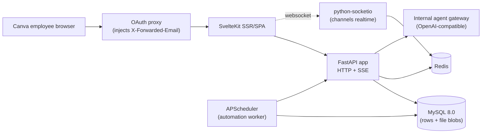
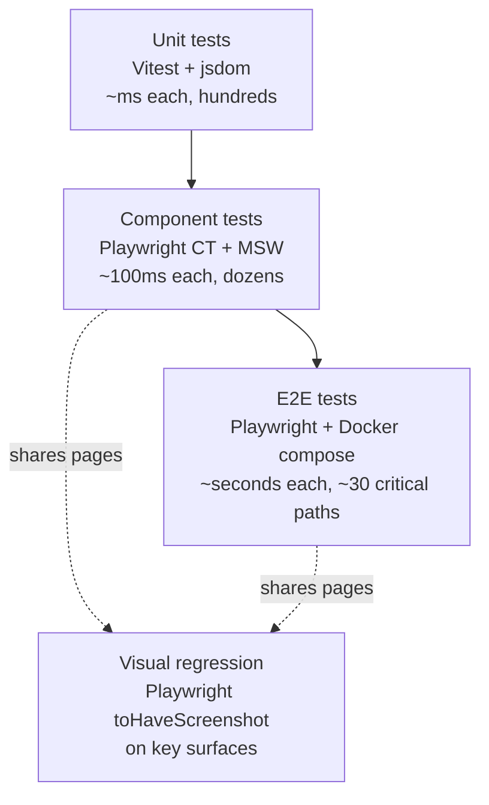

# Slim Rebuild of Open WebUI for Internal Use

## 0. Milestones at a glance

| ID  | Milestone                                                                                                                                                                                                                                                                                   | Estimate  | Plan file                                                                        |
| --- | ------------------------------------------------------------------------------------------------------------------------------------------------------------------------------------------------------------------------------------------------------------------------------------------- | --------- | -------------------------------------------------------------------------------- |
| M0  | Foundations: `rebuild/` skeleton, MySQL+Redis compose, Alembic baseline, ruff/mypy/pytest, Vitest+Playwright, trusted-header auth, `/healthz`+`/readyz`, Docker, Buildkite                                                                                                                  | 1 week    | [rebuild/docs/plans/m0-foundations.md](rebuild/docs/plans/m0-foundations.md)     |
| M1  | Theming. Tokyo Night preset family (Day / Storm / Moon / Night), role-based CSS variable tokens, OS-mapped default with explicit-choice override, cookie + localStorage persistence (no DB), SSR-correct first paint, theme picker in settings + command palette, code/mermaid palette swap | 1 week    | [rebuild/docs/plans/m1-theming.md](rebuild/docs/plans/m1-theming.md)             |
| M2  | Conversations + history. `chat`/`folder` schema, CRUD, SSE streaming via `OpenAICompatibleProvider`, sidebar + conversation view, markdown render port                                                                                                                                      | 1.5 weeks | [rebuild/docs/plans/m2-conversations.md](rebuild/docs/plans/m2-conversations.md) |
| M3  | Sharing. `shared_chat` (no access table), share/unshare endpoints, public `/s/:token` route                                                                                                                                                                                                 | 2–3 days  | [rebuild/docs/plans/m3-sharing.md](rebuild/docs/plans/m3-sharing.md)             |
| M4  | Channels (full Slack-shape). All channel tables, socket.io w/ Redis adapter, threads/reactions/pinned/members/typing/read-receipts/webhooks/file-uploads, `@agent` auto-reply, port channel UI without dead imports                                                                         | 3–4 weeks | [rebuild/docs/plans/m4-channels.md](rebuild/docs/plans/m4-channels.md)           |
| M5  | Automations. `automation`/`automation_run` tables, APScheduler worker w/ `FOR UPDATE SKIP LOCKED`, execute against provider, post to chat or channel, port editor + RRULE picker                                                                                                            | 1.5 weeks | [rebuild/docs/plans/m5-automations.md](rebuild/docs/plans/m5-automations.md)     |
| M6  | Hardening + deploy. OTel + structured logs, rate limits, request timeouts, deploy pipeline, ops runbook, empty-slate cutover (no data migration)                                                                                                                                            | 3–4 days  | [rebuild/docs/plans/m6-hardening.md](rebuild/docs/plans/m6-hardening.md)         |

> **Cross-cutting plans** also live under [`rebuild/docs/plans/`](rebuild/docs/plans/) — currently the dev-only local agent platform plan ([`feature-llm-models.md`](rebuild/docs/plans/feature-llm-models.md)) lands an `agent-platform` (Pydantic AI + Ollama) compose service so `make dev` exercises the M2 streaming path end-to-end without an external token. Dev-loop only; the runtime image and prod deploy are unchanged.

## 1. Decision: rebuild, not strip

The current fork is ~39k LOC backend + ~128k LOC frontend, with three big architectural debts that are not fixable without a rewrite:

- `backend/open_webui/utils/middleware.py` is 5,057 lines and braids streaming, persistence, filters, RAG, tools, skills, code interpreter, MCP, web search and image gen into one call graph (see comment block at lines 2183–2186).
- `backend/open_webui/config.py` is 4,165 lines of `PersistentConfig` knobs; `env.py` adds another 1,056.
- Dual ORM (Peewee in `internal/migrations/` for legacy + SQLAlchemy with 41 Alembic revisions in `migrations/versions/`).

A clean rebuild trades 8–12 weeks of one engineer (or 5–7 weeks for two) for an estimated 5–7k LOC backend and 20–25k LOC frontend — a >80% reduction, all of it directly mappable to the six features you actually use (theming, conversations, sharing, channels, automations, hardening).

## 2. Target architecture



Two external services only: **MySQL** (rows + file blobs + scheduler row-lease via `SELECT … FOR UPDATE SKIP LOCKED` per [m5-automations.md § Scheduler worker (APScheduler)](rebuild/docs/plans/m5-automations.md#scheduler-worker-apscheduler)) and **Redis** (socket.io cross-replica adapter, sliding-window rate limiters, stream-cancel pub/sub, light cache — _not_ scheduler locks; M5 deliberately keeps lease state in MySQL so a single transactional commit advances both `last_run_at` and the run row). No object store, no separate cache cluster. The internal agent gateway is upstream infra, not ours.

**Stack:**

- Backend: Python 3.12, FastAPI, SQLAlchemy 2 async, `asyncmy` (async MySQL driver), Alembic, python-socketio, APScheduler, openai SDK + httpx, pydantic-settings, ruff, mypy, pytest.
- Frontend: SvelteKit 2 + Svelte 5, Tailwind 4, TypeScript strict.
- Testing: Vitest (unit) + Playwright (component, E2E, visual regression) + MSW (network mocks). See section 8.
- Infra: MySQL 8.0, Redis 7, single multi-stage Docker image, Buildkite (consistent with `.buildkite/` in the current repo, which already has `test-mysql` targets in [`Makefile`](Makefile)).

**Provider abstraction.** A single `OpenAICompatibleProvider` pointed at the internal agent gateway via a configurable `AGENT_GATEWAY_BASE_URL`. Agents are discovered dynamically via the gateway's OpenAI-compatible `/v1/models` endpoint (the path retains the OpenAI wire name for SDK compatibility — internally the rebuild calls each surfaced entry an "agent" with a preselected underlying model) and surfaced in the agent selector — no hardcoded agent catalogue, no provider matrix, no LiteLLM. The OpenAI SDK is used purely as transport.

**Local dev gateway (compose only).** The dev `docker compose` stack ships a small OpenAI-compatible local upstream alongside MySQL and Redis — `agent-platform`, a Pydantic-AI wrapper in front of an `ollama` daemon — so a fresh `make dev` produces a populated agent catalogue and streaming chat without any external token. This is dev-loop infrastructure (same category as the dev MySQL container), **not** a runtime provider class: `OpenAICompatibleProvider` stays the sole transport, the runtime image never picks up `pydantic-ai` or any LLM transitives, and staging/prod continue to point `AGENT_GATEWAY_BASE_URL` at the real internal gateway. The locked single-provider decision in §9 is unchanged. See [`rebuild/docs/plans/feature-llm-models.md`](rebuild/docs/plans/feature-llm-models.md).

**File storage.** Files live in MySQL as `MEDIUMBLOB` rows in a dedicated `file_blob` table, separate from the `file` metadata table so that listing files never pulls binary payloads. Hard cap of **5 MiB per file** enforced at upload (FastAPI `UploadFile` size check + MySQL `max_allowed_packet=16M`). With this cap, MEDIUMBLOB (max 16 MiB) is sufficient and avoids LONGBLOB's larger row overhead. Streaming reads still use chunked transfers to the client. The `FileStore` interface is a thin facade so we can swap to S3 if scale ever forces it later — no caller code changes when we do.

## 3. Auth model

Single dependency `get_user(request) -> User`:

1. Read `X-Forwarded-Email` (configurable). Reject if missing.
2. Look up `User` by email; insert if absent (name from `X-Forwarded-Name` if present).
3. Return `User`. No JWT, no cookies, no sessions, no `auth` table, no API keys, no LDAP, no SCIM, no roles, no groups, no permissions UI.

The current fork already proves this pattern works (`backend/open_webui/routers/auths.py:564–604`). We delete the surrounding 1,300 lines and use just the header path.

Sharing is **anyone-with-the-link, scoped to authenticated proxy users**. There is no per-user grant model, no public-internet exposure, and no `shared_chat_access` table — possession of the unguessable share token plus a valid `X-Forwarded-Email` is the entire access check. This makes the share endpoint a one-liner.

## 4. Data model (concise)

| Table                      | Key columns                                                                                                                                                                              | Notes                                                                                                                                                                                                                                                                                             |
| -------------------------- | ---------------------------------------------------------------------------------------------------------------------------------------------------------------------------------------- | ------------------------------------------------------------------------------------------------------------------------------------------------------------------------------------------------------------------------------------------------------------------------------------------------- |
| `user`                     | `id`, `email` (unique), `name`, `timezone`, `created_at`                                                                                                                                 | Auto-created on first request                                                                                                                                                                                                                                                                     |
| `chat`                     | `id`, `user_id`, `title`, `history` (JSON), `current_message_id` (STORED generated from `history`), `folder_id?`, `archived`, `pinned`, `share_id?`, `created_at`, `updated_at`          | One JSON blob is the source of truth, mirroring the current shape; MySQL 8.0 native JSON column with generated columns + functional indexes for hot lookups. `current_message_id` is a `VARCHAR(36) STORED GENERATED` projection of `history->>'$.currentId'` (m2-conversations.md § Data model). |
| `folder`                   | `id`, `user_id`, `parent_id?`, `name`, `expanded`, `created_at`, `updated_at`                                                                                                            | No `data.files` (no RAG)                                                                                                                                                                                                                                                                          |
| `shared_chat`              | `id` (unguessable token, 32-byte URL-safe), `chat_id`, `user_id`, `title`, `history` (snapshot, JSON), `created_at`                                                                      | Snapshot, not live. Token-only access (any authenticated proxy user).                                                                                                                                                                                                                             |
| `channel`                  | `id`, `user_id`, `name`, `description`, `is_private`, `is_archived`, `archived_at?`, `last_message_at?`, `created_at`, `updated_at`                                                      | No types/dm/group complexity. `is_archived` + `archived_at` for soft archive (m4-channels.md § Data model). `last_message_at` is denormalised from the latest `channel_message` and powers the channel-list ordering query.                                                                       |
| `channel_member`           | `channel_id`, `user_id`, `role`, `last_read_at`, `muted`, `pinned`, `joined_at`                                                                                                          |                                                                                                                                                                                                                                                                                                   |
| `channel_message`          | `id`, `channel_id`, `user_id?`, `bot_id` (`String(128)`, nullable), `webhook_id?`, `parent_id?`, `content` (JSON), `is_pinned`, `created_at`, `updated_at`                               | Threads via `parent_id`. CHECK constraint: exactly one of `(user_id, bot_id, webhook_id)` is non-null. `bot_id` is the agent id from the agent gateway; not a FK (agents are discovered from the gateway, not stored as users). Width 128 matches `automation.agent_id` (m5-automations.md § Data model).                |
| `channel_message_reaction` | `message_id`, `user_id`, `emoji`, `created_at`                                                                                                                                           | Unicode codepoint or `:shortcode:` — no custom emoji uploads                                                                                                                                                                                                                                      |
| `channel_webhook`          | `id`, `channel_id`, `name`, `token_hash` (`CHAR(64)`, hex SHA-256, unique), `last_used_at?`, `created_at`                                                                                | Incoming + outgoing. Plaintext token shown only at creation time; never persisted in cleartext.                                                                                                                                                                                                   |
| `channel_file`             | `channel_id`, `message_id?`, `file_id`, `uploaded_by?`, `created_at`                                                                                                                     | Join row only; `uploaded_by` is nullable so the `ondelete="SET NULL"` FK to `user.id` survives uploader deletion                                                                                                                                                                                  |
| `file`                     | `id`, `user_id`, `name`, `mime`, `size`, `sha256` (`CHAR(64)`, indexed via `ix_file_sha`), `created_at`                                                                                  | Metadata only; never selected with payload. 5 MiB upload cap enforced server-side.                                                                                                                                                                                                                |
| `file_blob`                | `file_id` (PK + FK), `data` (`MEDIUMBLOB`)                                                                                                                                               | Payload table; separated so list/metadata queries never load binary                                                                                                                                                                                                                               |
| `automation`               | `id`, `user_id`, `name`, `prompt`, `agent_id` (`String(128)`), `rrule`, `target_chat_id?`, `target_channel_id?`, `is_active`, `last_run_at?`, `next_run_at?`, `created_at`, `updated_at` | XOR CHECK on `(target_chat_id, target_channel_id)`. Width 128 on `agent_id` matches `channel_message.bot_id`.                                                                                                                                                                                     |

There is no `theme_preference` table or column anywhere — M1 theming is per-device client state, never DB-persisted. |
| `automation_run` | `id`, `automation_id`, `chat_id?`, `status`, `error?`, `created_at`, `finished_at?` | |

The above table is a **summary**; for the authoritative column list, types, defaults, indexes, and CHECK constraints of any given table consult the milestone plan that creates it (`rebuild/docs/plans/m{0,2..5}-*.md` — M1 ships no schema). Any add/rename/drop of a column lands in the milestone plan first; this summary is regenerated to match.

**Timestamp convention (project-wide).** All timestamps are stored as `BIGINT` epoch **milliseconds** (UTC). Helpers: `now_ms() -> int = time.time_ns() // 1_000_000`. SQL comparisons use `UNIX_TIMESTAMP() * 1000` for "now" or pass the value from the application. This applies to `user`, `chat`, `folder`, `shared_chat`, `channel`, `channel_member`, `channel_message`, `channel_message_reaction`, `channel_webhook`, `channel_file`, `file`, `automation`, `automation_run`, and any future tables. No `DATETIME` / `TIMESTAMP` columns anywhere — `rebuild/docs/best-practises/database-best-practises.md` §A.1 makes the no-mixing rule absolute. JSON serialisation uses the same integer.

No: `auth`, `api_key`, `group`, `access_grant`, `shared_chat_access`, `chat_message` (the parallel analytics table), `note`, `skill`, `tool`, `knowledge`, `memory`, `function`, `pipeline`, `prompt`, `feedback`, `oauth_session`, `calendar*`, `prompt_history`.

## 5. Phased delivery

**M0 — Foundations (1 week).** New code lands under a top-level `rebuild/` directory in this repo (see section 10). FastAPI/SvelteKit skeletons under `rebuild/backend/` and `rebuild/frontend/`, MySQL 8.0 + Redis dev compose under `rebuild/infra/`, Alembic baseline (charset `utf8mb4`, collation `utf8mb4_0900_ai_ci`), self-contained ruff/mypy/pytest config under `rebuild/`, Vitest + Playwright (incl. component-test mode `playwright init --ct`), trusted-header auth dep, `/healthz` + `/readyz`, multi-stage Docker image at `rebuild/Dockerfile`, new Buildkite pipeline `rebuild.yml` that runs only when `rebuild/**` changes (path filter) and runs in parallel to the legacy pipeline.

**M1 — Theming (1 week).** Lands the brand voice from [PRODUCT.md](PRODUCT.md) and the design tokens from [DESIGN.md](DESIGN.md) as a working theme system. Four Tokyo Night presets ship: **Tokyo Day** (the only light variant; OS-mapped when `prefers-color-scheme: light`), **Tokyo Storm** (slate-blue dark; explicit choice only), **Tokyo Moon** (warmer dark; explicit choice only), **Tokyo Night** (deepest dark; OS-mapped when `prefers-color-scheme: dark`). Each preset is a complete role-token bundle (`background-app`, `background-sidebar`, `background-topbar`, `background-elevated`, `background-code`, `background-mention`, `hairline*`, `ink-*`, `accent-*`, `status-*`, `syntax-*`) defined as CSS custom properties on `[data-theme="tokyo-{name}"]` (selector is unprefixed so the M1 `ThemePicker` can give each preview tile its own preset cascade) and consumed by Tailwind via `@theme inline`. The Shiki code-block highlighter and the Mermaid diagram theme are generated from the same tokens so chrome and content swap together. Resolution order: explicit user choice > OS preference > `tokyo-night` fallback. **Persistence is client-only** — a `theme` cookie carries the choice for SSR-correct first paint (no FOUC), mirrored to `localStorage` as the source of truth on the client; nothing reaches MySQL. A theme picker component lives in Settings and is reachable from the command palette as `Theme: …`. No backend schema, no Alembic revision; this milestone is frontend-only and covers the inline boot script in `app.html`, the SvelteKit `handle` hook that reads the cookie and emits `<html data-theme="…">`, the `themeStore` runes-class, the picker UI, the Shiki/Mermaid generators, and the visual-regression baselines for all four presets across the empty-chat / streamed-reply / sidebar surfaces. **Sequencing rationale:** M1 ships before any feature surface so M2–M6 build directly against the role-token vocabulary instead of porting hex literals that would need to be retrofitted later.

**M2 — Conversations + history (1.5 weeks).** `chat` + `folder` schema, full CRUD endpoints, SSE streaming endpoint that calls `OpenAICompatibleProvider.stream(messages, agent_id, params)` against the internal agent gateway (the SDK call still passes the chosen agent id as the OpenAI `model=` field — the provider is a translation seam), dynamic agent catalogue discovery via the gateway's `/v1/models` path, sidebar + conversation view + minimal message input. Markdown rendering ported from `src/lib/components/chat/Messages/Markdown/*` minus citations/sources/embeds. All chrome reaches for the M1 role tokens; markdown headings inside chat render in `accent-headline` (the only place an accent hue is used as block-level text colour); code blocks render via the M1 Shiki theme.

**M3 — Sharing (2–3 days).** `shared_chat` schema (no access table), `POST/DELETE /chats/:id/share` mints/revokes a token, `GET /s/:token` returns the snapshot for any authenticated proxy user. Public `/s/:token` SvelteKit route with read-only renderer reusing the M2 message components. Smaller than originally scoped because the access model is just "valid token + valid header". The share view inherits the active theme via the same M1 cookie path.

**M4 — Channels (3–4 weeks; biggest piece).** All channel tables, socket.io rooms `channel:{id}` with Redis adapter for multi-instance, threads, reactions, pinned, members, typing, read receipts, incoming + outgoing webhooks, file uploads via API-proxied multipart (no signed URLs since blobs live in MySQL — uploads stream straight into `file_blob` with a 5 MiB cap), `@agent` auto-reply via background task that calls the same provider abstraction. Frontend ports `src/lib/components/channel/*` with the dead tools/skills/notes imports removed.

**M5 — Automations (1.5 weeks).** APScheduler worker that polls every 30s with `SELECT … FOR UPDATE SKIP LOCKED` (MySQL 8.0 native), executes each due automation by calling provider streaming and persisting result either as a new chat or as a channel post (your `target_*` choice). Frontend: list + editor with RRULE picker (port from `src/lib/components/automations/*`), run history.

**M6 — Hardening + deploy (3–4 days).** No data migration: the new app stands up with empty databases and users start fresh. Scope is observability (OpenTelemetry traces + structured logs), rate limits, request timeouts, deploy pipeline, runbook. Cutover day: deploy the new image, point the OAuth proxy at it, decommission the old service. The launch banner is themed via the active M1 preset (no separate "launch palette").

## 6. Reuse map (legacy tree → `rebuild/`)

**Port with simplification:**

- Markdown + code-highlight pipeline from `src/lib/components/chat/Messages/Markdown/*` (drop citations, embeds, source overflow).
- CSS `content-visibility: auto` virtualization recently added in v0.9.2.
- Channel UI shell `src/lib/components/channel/*` (drop tools/skills/notes imports; the core posting + thread + pinned + webhook UI is reusable).
- Automation editor + RRULE picker `src/lib/components/automations/*`.
- Trusted-header auth pattern from [`backend/open_webui/routers/auths.py`](backend/open_webui/routers/auths.py) lines 564–604.
- Socket.IO room/event names `channel:{id}` and `events:channel`/`events:chat` from [`backend/open_webui/socket/main.py`](backend/open_webui/socket/main.py) lines 401–522 — keep the protocol, rewrite the implementation.

**Do not port:**

- `Chat.svelte` (3.1k LOC), `MessageInput.svelte` (2.1k LOC), `Messages.svelte`, `Navbar.svelte` — rewrite from scratch totalling ~1k LOC.
- [`backend/open_webui/utils/middleware.py`](backend/open_webui/utils/middleware.py) (5k LOC) — replace with one straight streaming function (~300 LOC) that calls the provider, splits SSE chunks, appends to `chat.history`, broadcasts deltas.
- [`backend/open_webui/config.py`](backend/open_webui/config.py) (4k LOC) — replace with one `Settings(BaseSettings)` (~200 LOC).
- All Ollama, pipelines, functions, filters, tools, skills, knowledge, retrieval, notes, calendar (UI), evaluations, terminals, MCP, audio, images, web-search routers and models.

## 7. Effort, risks, recommendation

**Effort:** 8–12 weeks for one engineer end-to-end, 6–8 weeks for two with parallel M2/M4 tracks. (M6 dropped from ~1 week to 3–4 days now that there is no data migration; M1 theming adds ~1 week as a new dedicated milestone but pays itself back across M2–M6 by giving every later feature a stable role-token vocabulary instead of churn against hex literals.)

**Risks:**

- Channels realtime at Canva-wide scale needs Redis-backed socket.io and careful presence/typing fan-out. Plan for benchmark at end of M4.
- `@agent` channel auto-reply needs cancellation + per-channel concurrency caps to avoid runaway completions.
- **Theme FOUC.** A naive `localStorage`-only theme system flashes the wrong palette on first paint while JS hydrates, which is unacceptable on a tool people stare at all day. M1 mitigates with a cookie-driven server-rendered `<html data-theme="…">` and an inline boot script that runs _before_ the SvelteKit hydration. The cookie + localStorage mirror is the contract; deviation re-introduces the flash. See [m1-theming.md § Persistence](rebuild/docs/plans/m1-theming.md#persistence).
- **User communication for the empty-slate launch.** No data migration means existing users lose chat history, channel scrollback, and configured automations on cutover day. This is a product decision, not just a technical one — budget time for an in-product banner ("history reset on launch") and a Slack/email comms plan ahead of the cut.
- **MySQL as file store.** Comfortable for internal scale at a 5 MiB cap. Still watch (a) backup size, (b) replication lag on inserts, (c) `max_allowed_packet` and pool memory — pin `max_allowed_packet=16M` and use streaming reads. If files ever outgrow MySQL we swap the `FileStore` impl to S3, no schema change needed elsewhere.

**Recommendation:** rebuild. The five product features you keep (conversations, sharing, channels, automations, hardening) plus the M1 theming foundation are individually well-shaped (channels and automations are the only intricate ones), and removing the middleware monolith + dual ORM + config explosion is exactly the kind of debt that does not get paid down by upstream merges. The strip-down fork remains a credible Plan B if engineering capacity is constrained.

## 8. Testing strategy (regression-first)

Frontend testing is the single biggest insurance policy against the kind of "merge upstream and break the chat" regressions we want to escape. Standardize on **Playwright** for everything past unit tests — it is faster, multi-browser (Chromium + Firefox + WebKit), supports multi-context/multi-tab (essential for sharing and realtime channels), handles SSE/WebSocket reliably, and ships built-in component testing and visual regression in one tool.

### Test pyramid



### Layer 1 — Unit (Vitest + jsdom)

Pure logic only: stores, transformers, RRULE helpers, message-tree reducers, markdown sanitization, history-merge functions. Target sub-second runs of the full unit suite. Keep this layer dumb — no DOM, no network.

### Layer 2 — Component (Playwright Component Testing)

Initialize via `npm init playwright@latest -- --ct`. Renders one Svelte component in a real browser, mocked network via **MSW** so the same handlers can also drive the running app in dev. Cover:

- Message renderer (markdown, code blocks, math, mermaid) against a fixture corpus of chat history JSON.
- `MessageInput` keyboard interactions, paste handling, slash commands, mention picker.
- Channel message + thread + reaction + pin components in isolation.
- Automation editor (RRULE picker, target-channel dropdown).
- Sidebar list virtualization edge cases (50, 500, 5000 items).

### Layer 3 — End-to-end (Playwright + Docker compose)

Spin up a **deterministic stack** in CI: app + MySQL + Redis + a recorded-response **OpenAI mock server** (a tiny FastAPI process replaying golden SSE streams, indexed by request hash). Tests run against this stack with seeded fixtures via `playwright.config.ts` `globalSetup`. Use `request.headers.set('X-Forwarded-Email', …)` per `BrowserContext` to assume identities — this also lets one test assume two identities in two contexts simultaneously.

Critical regression paths to lock down:

| Path                                                                                                                                                   | Why it matters                                                                                                                                                           |
| ------------------------------------------------------------------------------------------------------------------------------------------------------ | ------------------------------------------------------------------------------------------------------------------------------------------------------------------------ |
| Theme picker: change preset → role tokens swap on every visible surface (chrome + code + mermaid) within one frame, no FOUC on full reload             | M1 contract; regressions here are a daily-papercut affecting every other surface                                                                                         |
| Theme: OS `prefers-color-scheme` flip with no explicit user choice → page reload picks the OS-mapped preset (light → Day, dark → Night); cookie absent | Confirms the OS-mapped default path                                                                                                                                      |
| Theme: explicit user choice persists across full reload and across tabs in the same browser, never appears in any DB row                               | Confirms the cookie + localStorage contract and the no-DB invariant                                                                                                      |
| Send message → SSE streams → tokens render → assistant message persisted on reload                                                                     | Most-used flow; SSE bugs are silent killers                                                                                                                              |
| Cancel mid-stream → server stops billing → DB has partial assistant message marked cancelled                                                           | Easy to regress when refactoring streaming                                                                                                                               |
| Create chat → pin → archive → restore → search → delete                                                                                                | History is the second-most-used flow                                                                                                                                     |
| Share chat → open `/s/:token` in second context → can read                                                                                             | Sharing is the easiest flow to break with auth refactors                                                                                                                 |
| Channel post in context A → realtime delta arrives in context B within 200ms                                                                           | Multi-context Playwright is the only good way to test this                                                                                                               |
| Channel `@agent` mention → assistant streams reply in thread → reactions/pins visible to both contexts                                                 | Couples the LLM provider mock to the channel realtime path                                                                                                               |
| Automation: create with `FREQ=MINUTELY` → fast-forward scheduler clock → run record + chat created                                                     | Use a `/test/scheduler/tick` endpoint exposed only when `ENV in {"test","staging"}`                                                                                      |
| Auth: missing trusted header → 401; spoofed header → 401 if not in allowlist                                                                           | Regressions here are security incidents. Includes a check that requests from outside `TRUSTED_PROXY_CIDRS` have `X-Forwarded-Email` stripped before reaching `get_user`. |
| File upload to channel → message attached → preview renders via `GET /api/files/{id}`                                                                  | Files are the only attachment surface and easy to break. No signed URLs (blobs live in MySQL).                                                                           |

### Layer 4 — Visual regression (Playwright `toHaveScreenshot`)

Capture baselines on the same Linux container that runs CI to avoid font-rendering drift. Apply on a small, curated list of surfaces — chat empty state, chat with one streamed reply, chat history sidebar, channel feed, channel thread, share view, automation editor, **and the theme picker / each preset's empty-chat surface**. Use `maxDiffPixels` rather than zero-tolerance, and a deterministic `--prefers-reduced-motion: reduce` style override + frozen `Date.now`. Update baselines via a manual workflow, never auto-merge. The M1 theming surfaces capture **one baseline per preset** (Day / Storm / Moon / Night × empty-chat / streamed-reply / sidebar = 12 baselines) so a regression in any role token surfaces in CI within minutes.

Pixel-diff alone is insufficient — a baseline captured against a buggy surface locks the bug in forever. The discipline in [rebuild/docs/best-practises/visual-qa-best-practises.md](rebuild/docs/best-practises/visual-qa-best-practises.md) splits Layer 4 into three coordinated sub-layers: **A** pixel-diff baselines (this section), **B** geometric-invariant journey specs (`@journey-m{n}`, Playwright assertions on `boundingBox()` rectangles — overlap, containment, min content width, no clipping — that fail on the first run when a bug is present), and **C** a milestone-acceptance `impeccable` design-review pass over the captured PNGs for everything A + B miss (hierarchy, rhythm, aesthetic correctness). Every milestone plan's `## User journeys` section binds the three layers together; the `verifier` subagent enforces the three-layer checklist before acceptance goes green.

### Recording-and-replay for OpenAI

Every E2E test that touches an agent uses a **request-hashed cassette**: first run records the upstream SSE stream to `tests/fixtures/llm/<hash>.sse`, subsequent runs replay byte-for-byte. This makes streaming tests deterministic, free, and offline. Cassettes are committed; refresh is a deliberate PR. The cassette key is computed from the OpenAI wire body, so the agent id (passed to the SDK as `model=`) is part of the hash.

### CI shape

- Unit + component: every push, all branches, parallel shards, target wall-clock < 3 min.
- E2E + visual regression: every push to PR branches against `main`, sharded across 4 workers, target wall-clock < 8 min.
- Smoke E2E (5 critical paths only): every commit to `main` and post-deploy in staging.
- Nightly: run E2E suite against latest WebKit + Firefox to catch browser drift.

### Coverage expectations

Target lines-of-code coverage is a poor metric here. Track instead:

- **Critical-path coverage**: every row in the table above has at least one passing E2E. Treat additions to `routers/` or `src/routes/(app)/` without a corresponding E2E as a blocker in code review.
- **Visual-baseline drift rate**: number of unintentional baseline updates per month. Target: zero.
- **Flake rate**: per-test retry count over 30-day rolling window. Target: < 0.5%. Quarantine flakes immediately; fix or delete within the sprint.

## 9. Decisions (locked)

- **Colour with intent — Tokyo Night family is the default palette, dark by default.** The brand voice in [PRODUCT.md § Brand Personality](PRODUCT.md#brand-personality) is \*precise, composed, kinetic, **coloured\***. The canonical reference is Obsidian's [Tokyo Night theme](https://github.com/tcmmichaelb139/obsidian-tokyonight) — a navy/indigo dark base with a small saturated accent palette (cyan, magenta, green, orange, soft red) used on a budget. Four shipping presets: **Tokyo Day** (light, OS-mapped to `prefers-color-scheme: light`), **Tokyo Storm** (slate-blue dark; explicit choice), **Tokyo Moon** (warmer dark; explicit choice), **Tokyo Night** (deepest dark, OS-mapped to `prefers-color-scheme: dark`; the brand-canonical look). Components reach for **role tokens** (`background-app`, `background-sidebar`, `accent-selection`, `ink-body`, …) — never a literal hex, never a preset name. Adding a fifth decorative hue, reverting any role token to a zero-chroma neutral, or hard-coding a hex literal in a component all require a documented exception. Greyscale is a fallback, not the look. The full palette and design tokens are in [DESIGN.md](DESIGN.md); the implementation contract is [m1-theming.md](rebuild/docs/plans/m1-theming.md).
- **Theme persistence is per-device, never DB.** The user's theme choice lives in a `theme` cookie (so the SvelteKit `handle` hook can SSR `<html data-theme="…">` for FOUC-free first paint) and in `localStorage` as the client source of truth. There is no `user.theme_preference` column, no settings table, no server endpoint that persists or syncs it. A user moving devices intentionally re-picks. This is the only product preference in the rebuild that is not server-tracked, and the asymmetry is deliberate — theme is a per-room comfort setting, not part of the user's identity. M1 includes one negative test asserting no theme value reaches MySQL on any code path.
- **No object store.** Files live in MySQL as `MEDIUMBLOB` in a dedicated `file_blob` table, with a **5 MiB per-file cap** and a `FileStore` facade so swapping to S3 later is a one-day change with no schema impact.
- **OpenAI-compatible only, single provider.** The internal agent gateway is the sole upstream; the OpenAI SDK is just transport. Agents are discovered at runtime via the gateway's OpenAI-compatible `/v1/models` path (the path keeps its OpenAI wire name for SDK compatibility — internally each surfaced entry is an "agent" with a preselected underlying model) — no hardcoded catalogue, no LiteLLM, no Anthropic/Gemini SDKs.
- **Sharing is anyone-with-the-link.** Possession of an unguessable share token plus a valid `X-Forwarded-Email` is the entire access check. No `shared_chat_access` table, no per-user grants, no public-internet exposure.
- **Empty-slate cutover. No data migration.** The new app launches with empty databases. Users start fresh on chats, channels, and automations. No migration tool, no parallel-run, no read-only freeze on the old data — just deploy, switch the proxy, decommission. Comms plan owns user-side expectations.
- **Same repository, new `rebuild/` subdirectory.** The rebuild ships in this repo (locked by org policy). Old code stays untouched on `main` alongside `rebuild/` so PRs can merge to `main` throughout the build. CI runs both trees in parallel via path-filtered Buildkite pipelines. On cutover, `rebuild/` is promoted to the repo root and legacy paths are deleted in a single sweep PR. See section 10 for layout and tooling boundaries.
- **Visual regression baselines in-repo via Git LFS.** Self-contained, audit-trail in Git, no external dependency. Baselines are captured on the same Linux container that runs CI to avoid font-rendering drift.
- **Identifiers are UUIDv7 strings stored as `VARCHAR(36)`.** Every `id` column on every table is generated app-side via the M0 helper `app.core.ids.new_id()` (RFC 9562). UUIDv7's leading 48-bit ms timestamp gives near-monotonic InnoDB B-tree insertion locality — the indexes on `chat`, `channel_message`, `file`, `automation`, and their friends stay cacheable under load without giving up application-side generation, FK readability, or globally unique cross-shard keys. `BINARY(16)` storage with `UUID_TO_BIN(?, 1)` was considered and rejected: the storage halving doesn't justify the SQLAlchemy `TypeDecorator` + every-call `BIN_TO_UUID` cost at internal scale, and UUIDv7 already captures the locality benefit `swap_flag=1` provides for v1. Direct `uuid.uuid4()` / `uuid4()` calls are banned via ruff `flake8-tidy-imports`; the helper is the only path. Revisit if `chat` exceeds ~10M rows or the M6 hardening benchmarks flag secondary-index bloat.
- **Single managed MySQL 8.0 instance.** Snapshot backups + binlog-based point-in-time recovery are the platform team's responsibility, not the rebuild's. No InnoDB Cluster, no Group Replication, no MySQL Router. HA at internal scale doesn't justify the operational complexity. The rebuild's job is to be backup-friendly (atomic DDL via the M0 helpers, no schema drift via `SET PERSIST` mirror rule in M6) and replica-friendly (read-only paths could be steered at a future read replica with no schema change), but operating the topology is upstream infra.
- **AWS Aurora MySQL with IAM database authentication in production.** Local development uses the static `rebuild:rebuild` MySQL container password baked into `rebuild/infra/docker-compose.yml`. Staging and prod connect to Aurora MySQL behind IAM auth: a short-lived `rds:GenerateDBAuthToken` is minted **per physical SQLAlchemy connection** via the M0 helper `app.core.iam_auth.attach_iam_auth_to_engine`, which fires inside SQLAlchemy's `do_connect` event so pool churn (recycle / pre-ping / overflow) is the only thing that needs to outpace the ~15-minute token TTL. boto3 is imported lazily so the dev path doesn't pay for it; the helper hooks both the runtime engine (`app/core/db.py`, with `user=settings.DATABASE_IAM_AUTH_USER`) and the Alembic migration engine (`backend/alembic/env.py`, with `user=settings.DATABASE_IAM_AUTH_MIGRATE_USER`). **Today** there is **one** Aurora-side IAM user with `ALL PRIVILEGES`, and both env vars hold the same value; the per-engine setting split is a deliberate seam so the future least-privilege migration (runtime user → `SELECT, INSERT, UPDATE, DELETE`; migrate user → `ALL PRIVILEGES`) lands as a values-file change, not a code change. Pods bind to IAM roles via IRSA / EKS Pod Identity, so **no DB password is ever rendered into a Kubernetes `Secret`**. The full surface — `Settings` knobs (`DATABASE_IAM_AUTH`, `DATABASE_IAM_AUTH_REGION`, `DATABASE_IAM_AUTH_HOST`, `DATABASE_IAM_AUTH_PORT`, `DATABASE_IAM_AUTH_USER`, `DATABASE_IAM_AUTH_MIGRATE_USER`), helper functions, validation, and the host/port-override rationale — lives in [`rebuild/docs/plans/m0-foundations.md` § IAM database authentication](rebuild/docs/plans/m0-foundations.md#iam-database-authentication); the operational do/don't list (single-IAM-user-today, two-settings-for-the-future-split) lives in [`rebuild/docs/best-practises/database-best-practises.md` § B.9](rebuild/docs/best-practises/database-best-practises.md). Reference: [AWS Aurora User Guide — Connecting using IAM authentication and the AWS SDK for Python (Boto3)](https://docs.aws.amazon.com/AmazonRDS/latest/AuroraUserGuide/UsingWithRDS.IAMDBAuth.Connecting.Python.html).
- **Robust, idempotent Alembic migrations.** Every migration is safe to re-run and safe to abort half-way through. MySQL 8.0 auto-commits each DDL statement, so a partially-applied revision is the worst-case outcome of a crashed `alembic upgrade`; the rerun must succeed without operator intervention. The convention, applied uniformly across M0 + M2–M5 (the schema-having milestones; M1 ships no migration), is: use MySQL-native `IF NOT EXISTS` / `IF EXISTS` where it exists (`CREATE TABLE`, `DROP TABLE`, `DROP INDEX` on MySQL 8.0.29+); use a small helper module `app.db.migration_helpers` (defined in M0, see [rebuild/docs/plans/m0-foundations.md § Migration helpers](rebuild/docs/plans/m0-foundations.md#migration-helpers)) that wraps `op.create_index`, `op.add_column`, `op.create_foreign_key`, `op.create_check_constraint`, etc. with SQLAlchemy `inspect()` pre-checks for everything else. Every revision's `upgrade()` and `downgrade()` calls only the helper variants (`create_index_if_not_exists`, `add_column_if_not_exists`, `drop_constraint_if_exists`, …); raw `op.*` calls are forbidden in migration files and enforced by a ruff-style grep gate in CI. This makes the M6 Helm pre-upgrade Job (which has `backoffLimit: 0` but is itself retried by humans on failure) safe to re-run, and protects against the scenario where a migration adds three indexes, the second succeeds, the third fails on a transient lock, and the operator has to fix-forward.

## 10. Repository layout and tooling boundaries

```
/                          legacy tree (untouched until cutover)
  backend/                 existing Open WebUI fork
  src/                     existing Svelte 4 frontend
  pyproject.toml           legacy Python deps
  package.json             legacy JS deps
  .buildkite/pipeline.yml  legacy CI
rebuild/
  backend/                 FastAPI + SQLAlchemy + Alembic
  frontend/                SvelteKit 2 + Svelte 5
  infra/                   docker-compose.yml, mysql/, redis/
  plans/                   per-milestone implementation plans (M0..M6)
  pyproject.toml           rebuild Python deps (no shared lock with legacy)
  package.json             rebuild JS deps (separate node_modules)
  Dockerfile               multi-stage build
  Makefile                 rebuild-only targets
  .buildkite/rebuild.yml   rebuild CI pipeline
rebuild.md                 top-level plan (this document)
README.md                  documents the dual-tree state
```

**Tooling rules during the dual-tree period:**

- All rebuild commands run from `rebuild/` (`cd rebuild && make test`). No tooling crosses the boundary.
- Each tree has its own dependency graph. No shared `pyproject.toml`, no shared `package.json`, no shared lockfiles. This avoids accidental version drift and lets each tree upgrade independently.
- The rebuild's Buildkite pipeline uses path filters (`if: build.changed_files =~ /^rebuild\//`) so PRs touching only legacy don't run rebuild CI and vice versa.
- Pre-commit / lint hooks branch on path: ruff/mypy under `rebuild/` use the rebuild's config, the rest use legacy config.
- The rebuild's Docker image and the legacy image have distinct tags; the deployment pipeline ships them to separate environments until cutover.

**Cutover sweep PR (end of M6):**

1. `git mv rebuild/* .` (promote rebuild to root).
2. Delete legacy `backend/`, `src/`, legacy `pyproject.toml`, legacy `package.json`, legacy CI pipeline.
3. Update `README.md` and the single Buildkite pipeline file.
4. Tag the previous commit as `legacy-final` so the old tree is recoverable from history.

This sweep is mechanical and reviewable in one sitting because the rebuild tree has been live and tested for weeks by that point.
